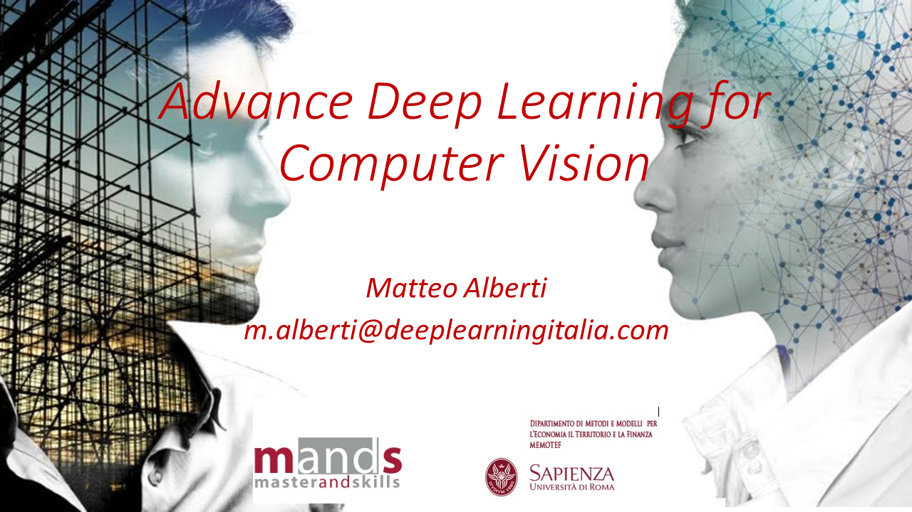

# Lecturer DeepLearningItalia Intro
Public Repository for my Lecturer at Roma La Sapienza | Roma Tor Vergata for Big Data & Analytics Masters

 

# My Courses focuses on mathematical backgroud of deep learning models for computer vision systems

### In detail I covered the following arguments with an Hands-On methodology:

#### Introduction to Computer Vision Systems and Deep Neural Networks
  - Convolutions | Pooling and other main layers
  - Understand Architectures (this is not a black-box!)
  - From LeNet to the State of the Art (ResNet)

#### Introduction to Object Detection & Semantic Segmentation
  - Introduction to Autoencoder [AE]
  - Convolutional Autoencoder [UNet]
  - Capsule Neural Networks [CapsNet]

#### for every kind of information please refers to the following contact:

www.linkedin.com/in/matteo-alberti-695570110
